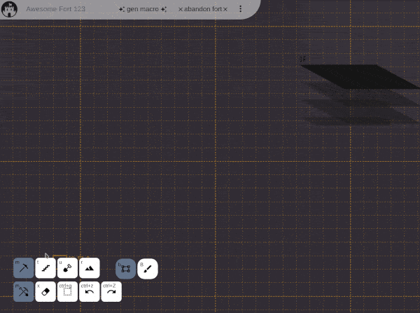

# Playground

[playground](https://eunchuldev.github.io/df-fortforge/)

# ScreenShot

# Why made DF FortForge

I am a user who enjoys Dwarf Fortress. My play usually goes like this. As soon as the game starts, press pause. And design the entire fortress over several hours. The finished design looks aesthetically pleasing, functionally flawless, and perfectly efficient, at least in theory. And if I press the play button.. Less than an hour later, the fortress falls for various reason.

Losing itself is not a problem. The problem is that I believe there is an ideal fort design somewhere. I desire to incrementally improve my fortress design to find the best one. To do so, I have to build again and again an entire fort nearly identical to the last run. It is tedious and unefficient, especailly when using the unfamiller Dwarf Fortress user interface.

Dwarf fortress Built-in Macro is useful to repeat small task, but not really helpful to build entire fortress. I've heard about DFHack and QuickFort, but they are not working with steam version at this moment. So I decide to made my own construction tool.

# Who can use DF FortForge

- Who tends to prepare and design the fort longer than actual playing
- Who wants to separate the design and building process
- Who wants to design a fortress as if manipulating an image: select, copy, paste, rotate, and flip the part.

# What is the limitation of DF FortForge

- At this moment, it only has four designation targets: dig, ramp, channel, and stairs
- The designation does not reflect the in-game mechanism. For example, it can't detect cave-in
- It has not tested well so might be buggy at this moment

# How it works

It generates a DF macro of the given fort design. the generated macro file can be loaded into Dwarf Fortress. You can visit the [playground](https://eunchuldev.github.io/df-fortforge/) and click the `gen macro` button to check the detail instruction.
